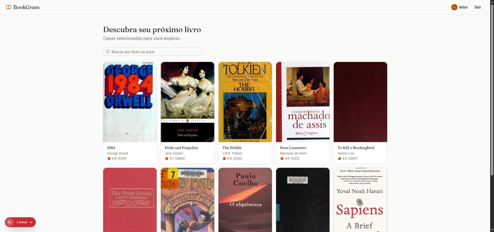
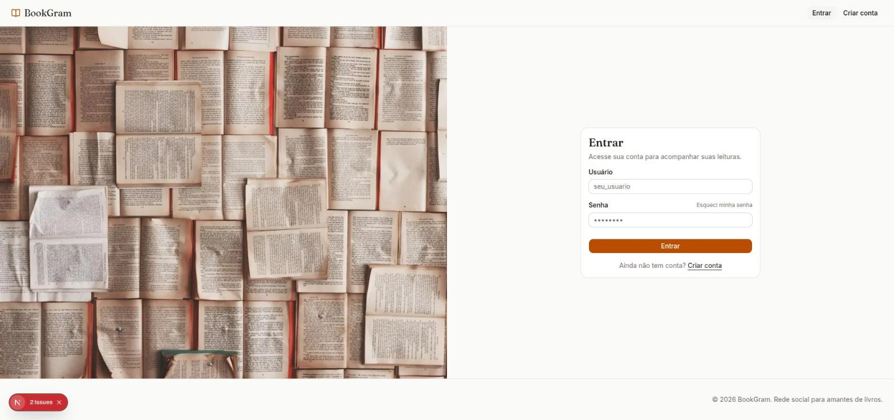
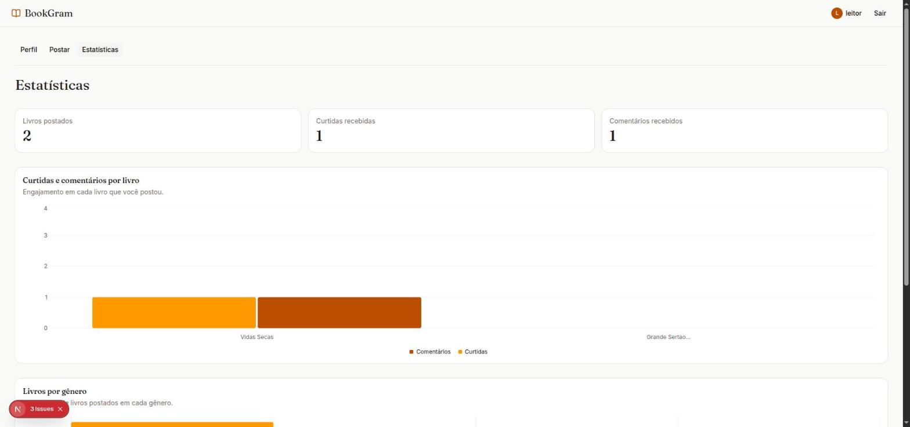
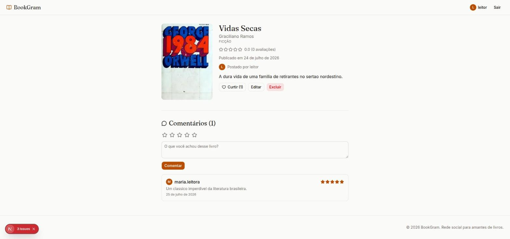
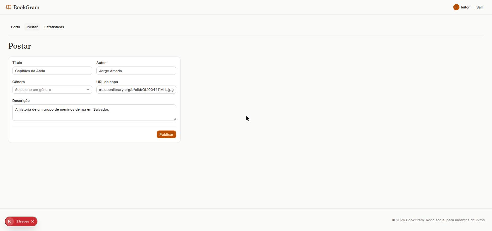

# BookGram

Rede social para leitores: descubra livros, curta, comente e avalie suas leituras,
e acompanhe estatísticas de engajamento dos livros que você postou.

## Resumo do projeto

BookGram é uma aplicação full-stack composta por um backend REST em **Spring Boot**
e um frontend em **Next.js (App Router)**. O sistema permite que usuários
autenticados cadastrem livros, curtam e comentem publicações de outros usuários, e
acompanhem um painel de estatísticas com gráficos de engajamento. Toda a autorização
de escrita (criar, editar, excluir) é validada tanto na interface quanto no backend,
via token JWT.

## Tecnologias utilizadas

**Backend**
- Java 21 + Spring Boot 4 (Web, Data JPA, Validation, Flyway)
- PostgreSQL 16
- JJWT (emissão/verificação de tokens JWT)
- Spring Security Crypto (hash de senha com BCrypt)
- Maven

**Frontend**
- Next.js 16 (App Router) + React 19
- TypeScript
- Tailwind CSS + shadcn/ui (Base UI)
- Recharts (gráficos)
- `jose` (verificação de JWT no servidor Next.js)

**Infraestrutura**
- Docker + Docker Compose (API + PostgreSQL)

## Funcionalidades implementadas

- **Autenticação real**: cadastro, login, "esqueci minha senha" (com token real,
  expira em 1h, uso único) e sessão via JWT assinado pelo backend.
- **Gêneros**: CRUD completo.
- **Livros**: CRUD completo com busca por título/autor, paginação, capa e gênero.
  Somente o autor do livro pode editar ou excluí-lo — validado no frontend (oculta
  os botões) **e** no backend (retorna 401/403 se o token não pertencer ao dono).
- **Comentários e avaliações**: notas de 1 a 5 estrelas + texto, com edição/exclusão
  restritas ao autor do comentário.
- **Curtidas**: curtir/descurtir livros.
- **Painel de estatísticas**: gráficos de curtidas/comentários por livro e livros por
  gênero (Recharts).

## Como rodar o projeto

### Pré-requisitos
Docker, Docker Compose, Node.js 20+ e um gerador de string aleatória (`openssl`).

### 1. Configurar variáveis de ambiente

Gere um segredo para o JWT (precisa ser **idêntico** nos dois arquivos abaixo):

```bash
openssl rand -base64 32
```

Na raiz do projeto:
```bash
cp .env.example .env
# edite .env e defina JWT_SECRET com o valor gerado acima
```

Em `web/`:
```bash
cp web/.env.example web/.env.local
# edite web/.env.local e defina o MESMO JWT_SECRET
```

### 2. Subir o backend + banco de dados

```bash
docker compose up -d --build
```

A API sobe em `http://localhost:8080` e aplica as migrations do Flyway
automaticamente (schema + dados de demonstração).

### 3. Rodar o frontend

```bash
cd web
npm install
npm run dev
```

Acesse `http://localhost:3000`.

### Credenciais de demonstração

| Usuário | Senha |
|---|---|
| `leitor` | `leitor123` |
| `maria.leitora` | `maria123` |

## Telas

### Home — descoberta de livros


### Login


### Painel de estatísticas


### Detalhe do livro e comentários


### Cadastro de livro

